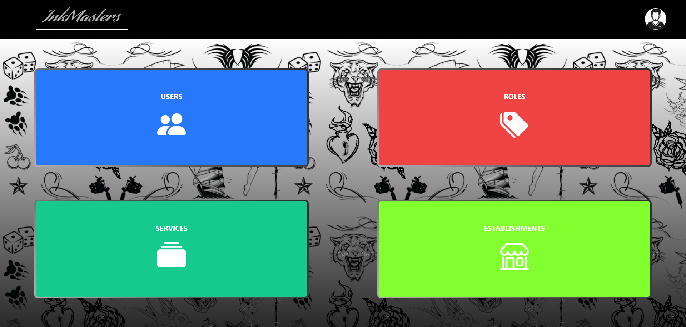

<h1 align="center">
   
  
   
  InkMasters Website React
   
</h1>

<h4 align="center">App for a tattoo shop bussiness</h4>

  <a href="#-key-features">Key Features</a> •
  <a href="#-project-objective">Project objective</a> •
  <a href="#-backend">Backend</a> •
  <a href="#️-stack">Stack</a> •
  <a href="#️-views">Views</a> •
  <a href="#️-future-improvements">Future improvements</a> •
  <a href="#-you-may-also-like">You may also like...</a>

## 🔑 Key Features

* Landing page with services offered by the shop
* Register for create appointments on the shops of the bussiness
* Profile in which you can update your data and your custome avatar
* Appointments view in which you can create new appointments, modify them and delete when yu desire
* Admin view panel to edit all the data of the application: users, services, establishments...
* Control in all moment of credentials inside the application

## 🎯 Project objective

This website is a project focused on the React facilities and cool interactions that you can make to update the views and interact with them, focused on the creation of a tattoo bussiness in which you can administrate your users, locals, services and roles and, moreover, allows to registered users to create appointments requesting the services of the shop.

## 🔗 Backend

This project is developed based on a previous [project](https://github.com/CariblaGIT/InkMasters) that I have made for making possible all the consults that are actually done in this application

## ⌨️ Stack

 

## 🖥️ Views

<h4 align="center">Initial interface</h4>

<h4 align="center">Login & Register</h4>

<h4 align="center">Appointments</h4>

<h4 align="center">Appointments interactions (like this in all entities)</h4>

<h4 align="center">Profile</h4>

<h4 align="center">Edit Profile</h4>

<h4 align="center">Admin panel</h4>

## 🛠️ Future improvements

✅ Each user has an avatar and can change it
 
⬜ Finishing CRUD for all entities
 
⬜ Making the website full responsive for all devices
 
⬜ Improve landing page

## 👀 You may also like...

- [Between Sins](https://gitlab.com/daghdha1/betweensins) - RPG videogame 
- [Mars Alienated](https://gitlab.com/AdrianGarciaAndreu/mars-alienated-rv-htc) - VR escape room experience in a space station

